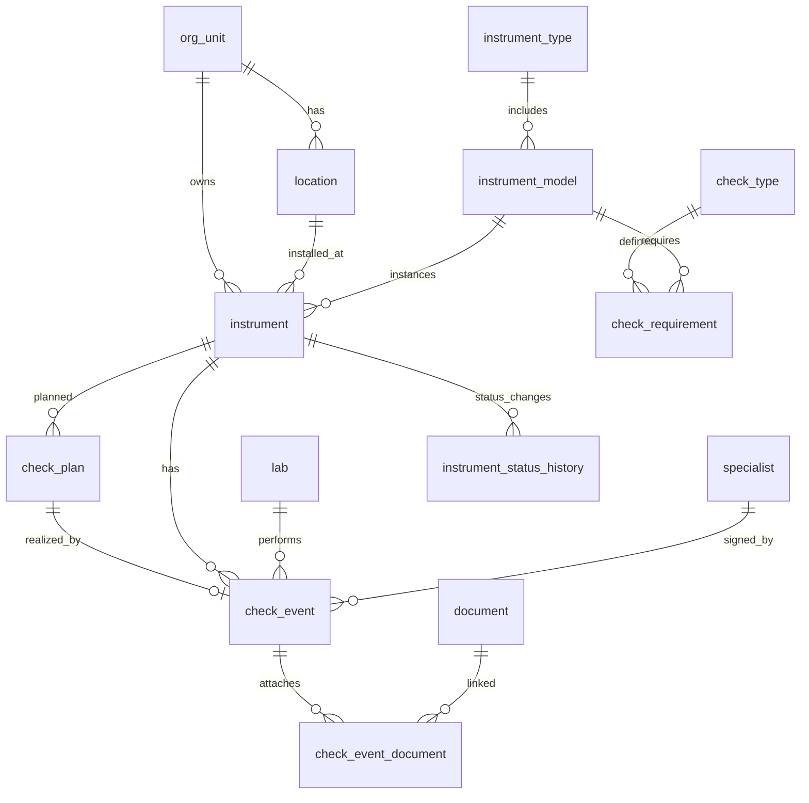

## ER-модель (текст + связи + кардинальности)

### Сущности
#### Справочники
- `org_unit` — подразделение/цех/отдел (иерархия через `parent_id`)
- `location` — место установки (принадлежит `org_unit`)
- `lab` — поверочная организация/лаборатория
- `specialist` — специалист (может быть привязан к `lab`)

#### Номенклатура СИ
- `instrument_type` — тип средства измерений
- `instrument_model` — модель/производитель (внутри типа)
- `instrument` — экземпляр прибора (инвентарный номер, место установки, статус)

#### Метрологические операции
- `check_type` — тип операции (поверка/калибровка)
- `check_requirement` — требование/регламент для пары (модель, тип операции): межповерочный интервал и т.п.

#### План/факт
- `check_plan` — запись плана на конкретный прибор и тип операции с `due_date` (плановой датой)
- `check_event` — факт проведения операции (дата, результат, протокол, следующая дата)

#### Документы
- `document` — документ по ссылке/идентификатору внешнего хранилища
- `check_event_document` — связь документ ↔ событие

#### История/аудит
- `instrument_status` — справочник статусов прибора
- `instrument_status_history` — история статусов (SCD2-подобная)
- `audit_log` — журнал изменений (JSONB старое/новое)

### Связи и кардинальности (ключевые)
- `org_unit (1) — (N) location`
- `org_unit (1) — (N) instrument`
- `location (1) — (N) instrument`
- `instrument_type (1) — (N) instrument_model`
- `instrument_model (1) — (N) instrument`
- `check_type (1) — (N) check_requirement`
- `instrument_model (1) — (N) check_requirement` (регламент задаём для модели)
- `instrument (1) — (N) check_plan`
- `check_plan (1) — (0..1) check_event` (план может не иметь факта)
- `instrument (1) — (N) check_event`
- `lab (1) — (N) check_event`
- `specialist (1) — (N) check_event` (опционально)
- `check_event (1) — (N) check_event_document (N) — (1) document`
- `instrument (1) — (N) instrument_status_history`

### Mermaid ER

